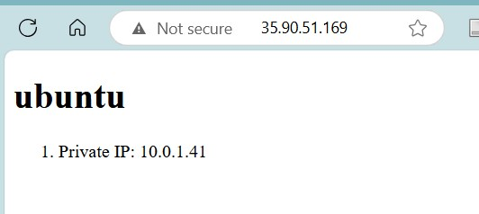

# 4640-w11-lab-start-w25

## This Ansible configuration uses dynamic Ansible inventory
Ensure that you have installed the following packages:
1. boto3
2. botocore

## Upload ssh keys to AWS
1. Generate ssh keys
> ssh-keygen -t ed25519 -f ~/.ssh/<name_of_key>
2. Import public key to AWS
> sh ./scripts/import_lab_key ~/.ssh/<name_of_key>.pub

## Build the AWS infrastructure
1. Go to terraform directory
> cd terraform
2. Build the infrastructure
> terraform init

> terraform apply

## Run the Ansible configuration
1. Go into the ansible directory
> cd ansible
2. Run the ansible playbook
> ansible-playbook playbook.yml

## Screenshot of the HTML document
